# Sudoku

A Sudoku app built with React Native, Expo and TypeScript (expo-router). It runs on iOS, Android and
the web, generates puzzles on the device, explains hints step by step, and teaches the solving
techniques with worked examples and endless practice.

## Features

- Puzzles generated on the device in four difficulties: Easy, Medium, Hard and Expert. Difficulty is
  the hardest technique a logical solver needs, and every puzzle has exactly one solution.
- Digit-first input: pick a digit on the pad, then tap cells to place it (or to toggle a note).
  Cell-first input works too. Eraser, pencil notes, undo, restart and a pause when the app goes to
  the background.
- A help sheet with a two-stage Hint (names the technique and highlights the pattern, then shows or
  applies the move), Mismatches, Validate and Auto Notes. Using help moves your time to a separate
  "assisted" leaderboard.
- Local statistics: games solved, best and average times per difficulty, clean versus assisted.
- Training: a rules intro and 17 technique lessons from Full House to XY-Wing. Each has a stepped
  worked example and endless practice on real positions. The hint links straight to the lesson.
- Dark (default) and light themes, a rounded Outfit typeface, haptics on device, and screen reader
  labels for cells, keys and buttons.
- Hard games come from a bundled bank of generated puzzles. The next puzzle for the current
  difficulty is prepared in the background, so "New Game" starts instantly.

## Screenshots

|                                                                 |                                                                  |                                                          |
| --------------------------------------------------------------- | ---------------------------------------------------------------- | -------------------------------------------------------- |
| 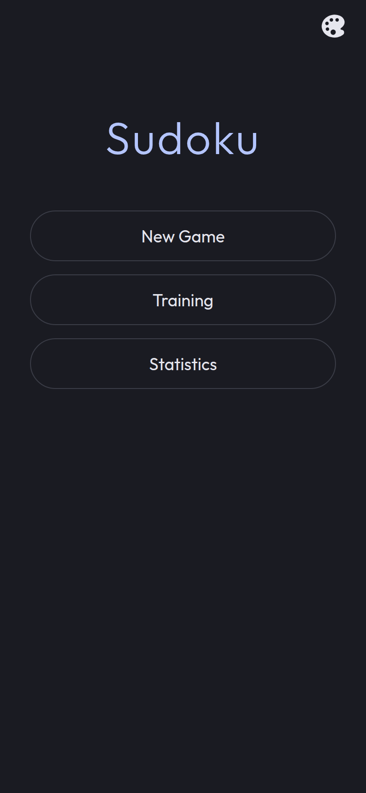                           | 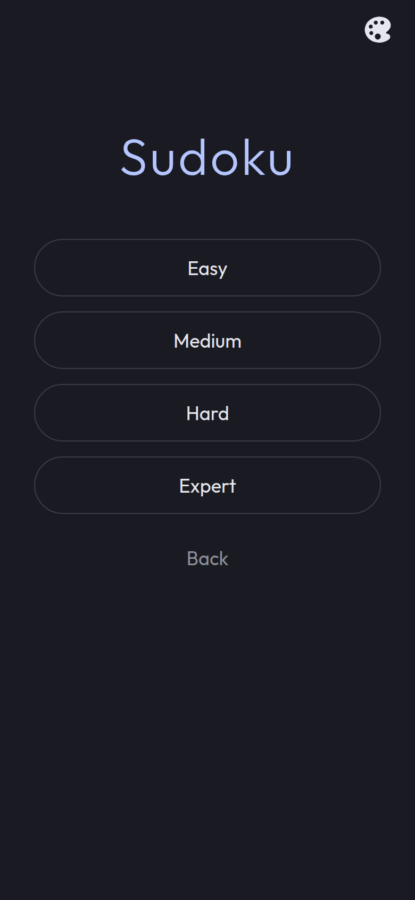             | 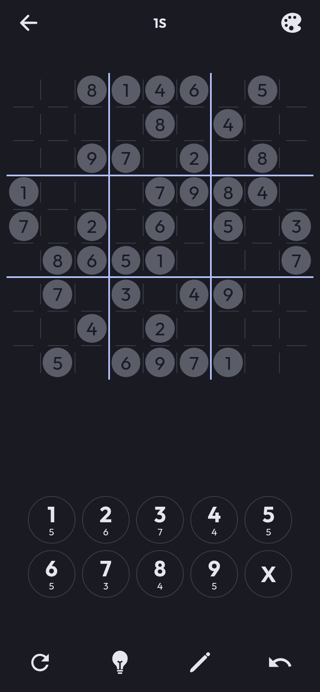              |
| Home                                                            | Choose a difficulty                                              | A fresh game                                             |
| 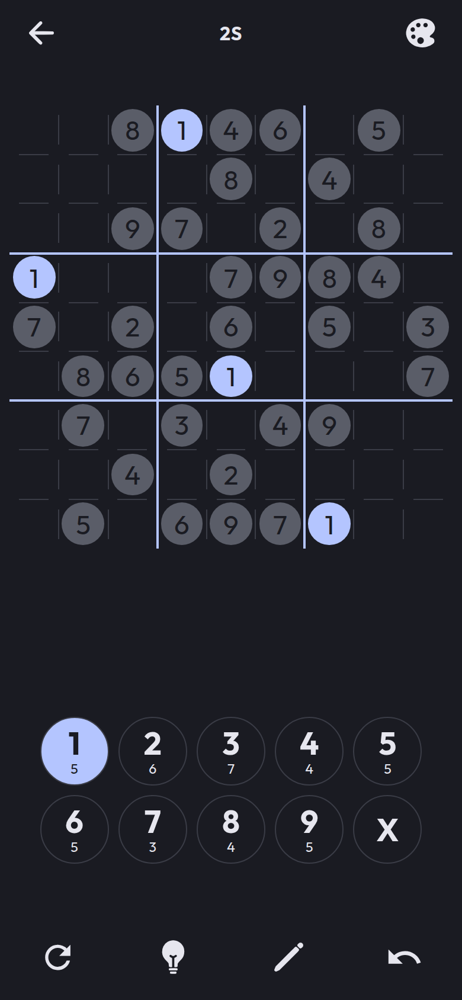     | 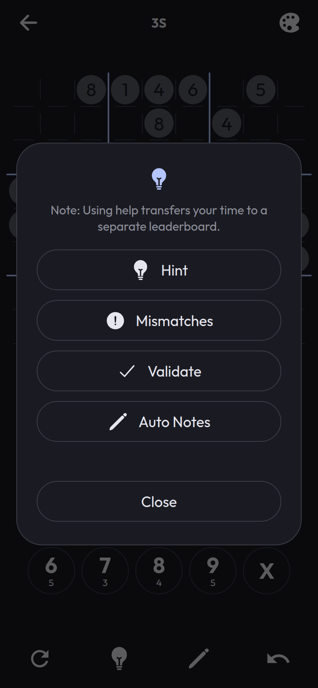                | 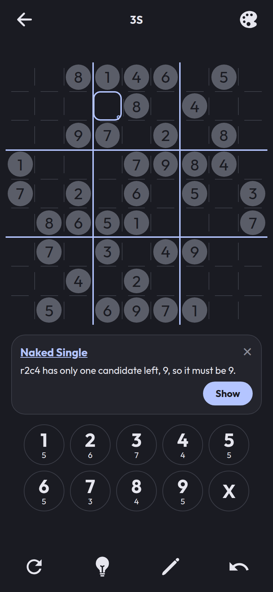            |
| Digit selected                                                  | Help sheet                                                       | Hint, stage 1                                            |
| 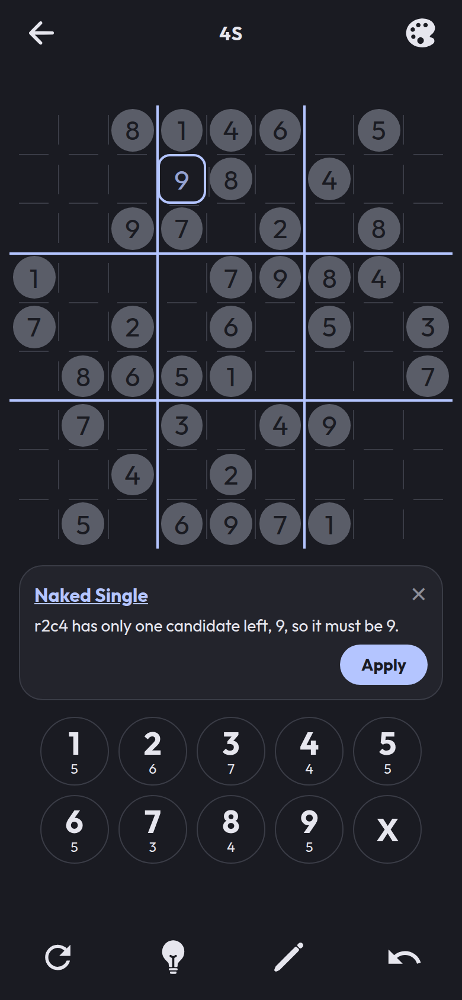           | 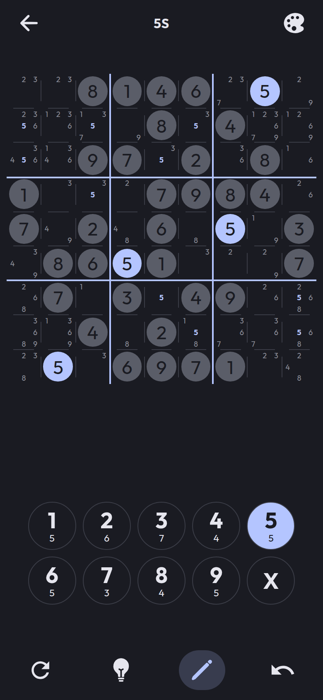               | 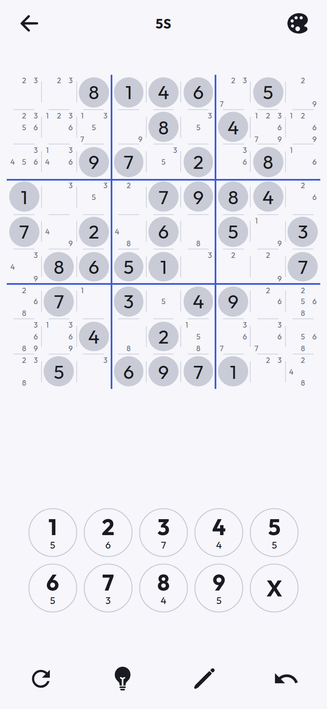 |
| Hint, stage 2                                                   | Notes and auto notes                                             | Light theme                                              |
| 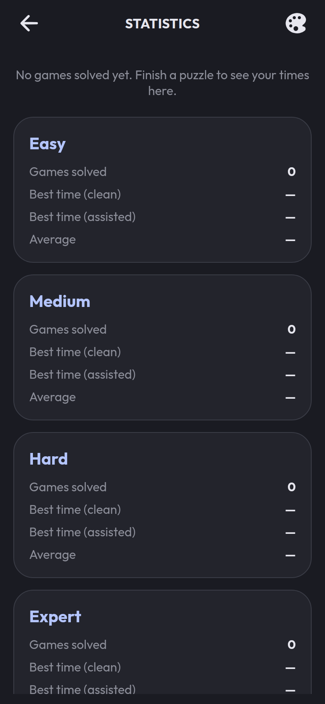                    | 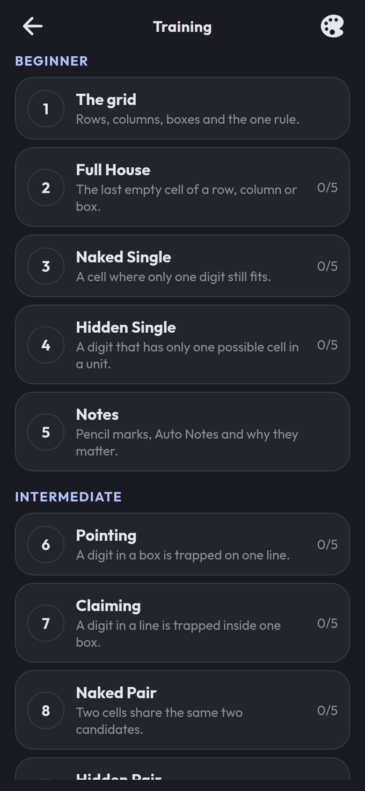          | 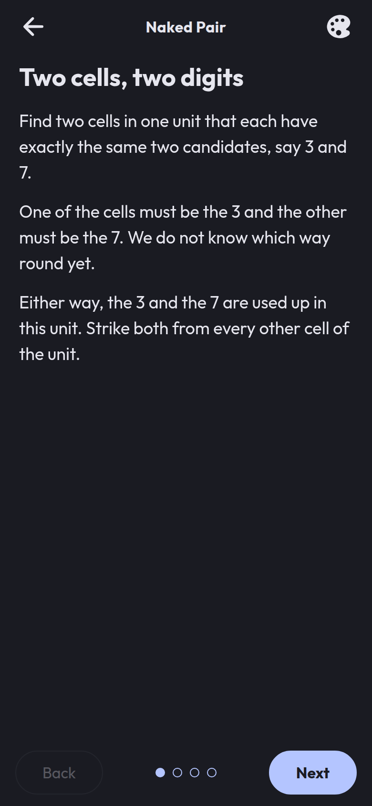        |
| Statistics                                                      | Training list                                                    | Lesson text                                              |
| 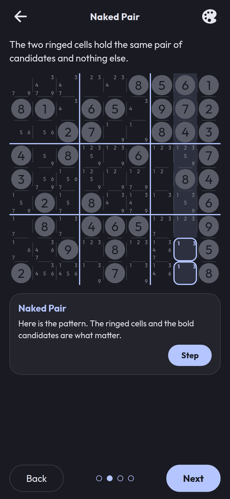      | 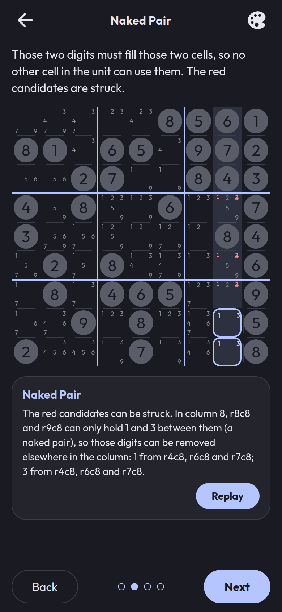         | 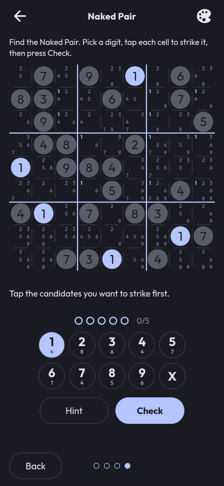      |
| Worked example, pattern                                         | Worked example, result                                           | Practice, wrong answer                                   |
| 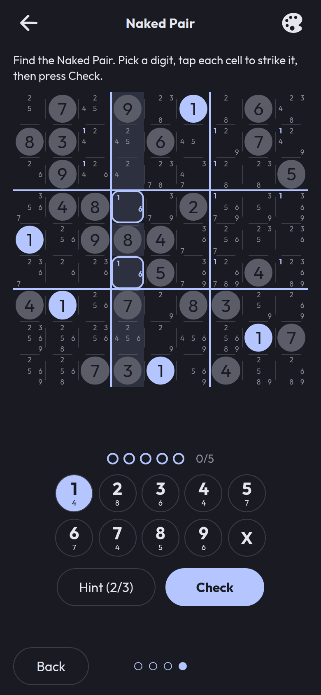 | 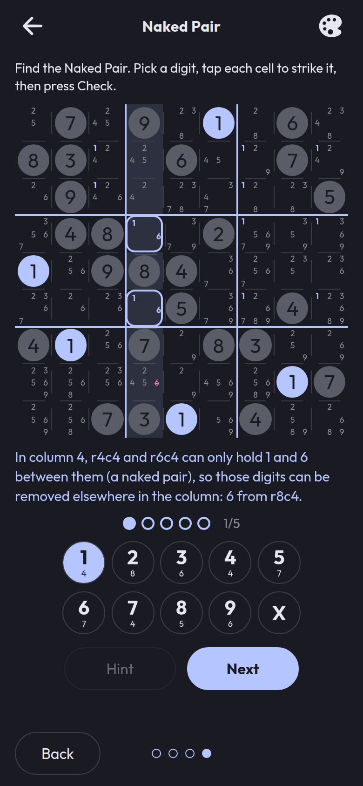 | 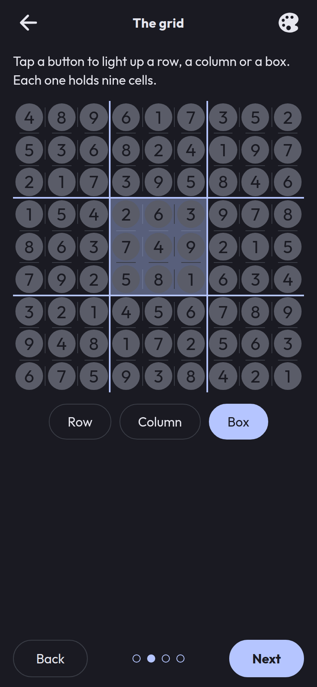            |
| Practice with a hint                                            | Practice solved                                                  | Rules: rows, columns, boxes                              |

## Run

```
npm install
npm start          # Expo dev server (scan with Expo Go)
npm run web        # run in the browser
npm run android    # or: npm run ios
```

## Test

```
npm test           # jest (jest-expo): engine, stores, UI
npm run typecheck  # tsc --noEmit
npm run lint       # eslint
npx prettier --check .
npm run e2e        # browser test, see below
```

`npm run e2e` (`scripts/e2e.cjs`) builds the web export, serves it, drives the app with Playwright in
the preinstalled Chromium at `/opt/pw-browsers/chromium` (override with `CHROMIUM_PATH`), starts an
Easy game, opens a hint and follows its technique link to the lesson, solves the puzzle digit-first,
and checks the win dialog and the Statistics screen. It is not part of `npm test`. Do not run
`playwright install`.

## Build

```
npx expo export --platform web   # static web build in dist/
```

Native builds go through EAS or `npx expo prebuild`. Do not bump `react`, `react-dom`,
`react-test-renderer`, `react-native-reanimated` or `react-native-worklets` on their own. They are
pinned to the Expo SDK 57 versions (see `docs/PLAN.md`, "Dependency pins").

## Project structure

```
app/                 expo-router screens: home, game, stats, training list and lesson
src/engine/          pure TypeScript (no React): grid, candidates, solver, techniques, generator, hints
src/engine/bank/     bundled Hard puzzle bank (hard.json)
src/state/           zustand stores: game, settings, stats, training progress
src/training/        lesson text (original), practice logic, bank.json of example positions
src/ui/              Board, Cell, NumberPad, BottomBar, HelpSheet, HintBanner, Text, theme
scripts/             offline bank builders and the e2e test
docs/                PLAN.md, task specs (docs/tasks), screenshots
```

## Rebuilding the banks

Both banks are produced by our own engine, offline, and committed as JSON.

```
# Hard puzzles (src/engine/bank/hard.json). Existing entries are kept; runs extend the bank.
npx tsx scripts/build-puzzle-bank.ts --count 150 --seed 1
# parallel shards, then combine
npx tsx scripts/build-puzzle-bank.ts --seed 2 --out shard2.json
npx tsx scripts/build-puzzle-bank.ts --merge shard1.json shard2.json

# Training positions (src/training/bank.json): solver snapshots per technique
npx tsx scripts/build-training-bank.ts --per 12 --minutes 5
npx tsx scripts/build-training-bank.ts --cap 24 --out bank.json --merge shard1.json shard2.json
```

See the header comment of each script for all options.

## Workflow: Opus manager, Sonnet developer

The project was built with two Claude roles:

- The main session (Opus) is the manager. It plans, writes the task specs in `docs/tasks/`, reviews
  diffs, runs the checks and commits. `docs/PLAN.md` holds the decisions, UI spec and milestones.
- The `sudoku-dev` agent (Sonnet, defined in `.claude/agents/sudoku-dev.md`) implements one
  well-specified task at a time, with tests, and reports files changed, results, decisions and gaps.
  It does not commit.
- `CLAUDE.md` is the shared rulebook: architecture, the pure-TypeScript engine rule, training text
  must be original, and the checks to run before committing.
